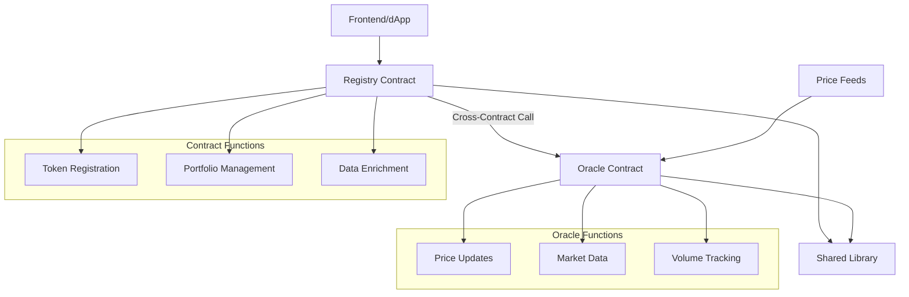

# w3pi Token Registry System

[](https://opensource.org/licenses/MIT)
[](https://use.ink/)
[](https://www.rust-lang.org/)
[](https://learn.onpop.io/)

A comprehensive smart contract system demonstrating advanced **cross-contract calling** patterns on Polkadot/Substrate chains. Built with ink! v5, this project showcases real-world DeFi architecture with oracle price feeds, portfolio management, and type-safe inter-contract communication.

## 🌟 Features

- **🔗 Cross-Contract Calls**: Registry contract fetches live price data from Oracle contracts
- **📊 Oracle Price Feeds**: Decentralized price and market data management
- **💼 Portfolio Management**: Token registration with weights, tiers, and balances
- **🔒 Type Safety**: Shared library ensures consistent types across contracts
- **⚡ Real-time Data**: Live market data integration through cross-contract calls
- **🛠️ Production Ready**: Comprehensive testing, documentation, and deployment tools

## 🏗️ Architecture



## 🚀 Quick Start

### Prerequisites

```bash
# Install Rust
curl --proto '=https' --tlsv1.2 -sSf https://sh.rustup.rs | sh

# Install ink! dependencies
rustup component add rust-src
rustup target add wasm32-unknown-unknown
cargo install --force --locked cargo-contract

# Install Pop CLI
cargo install --git https://github.com/r0gue-io/pop-cli
```

### Build & Deploy

```bash
# Clone the repository
git clone https://github.com/yourusername/w3pi.git
cd w3pi

# Build all contracts
./scripts/build.sh

# Deploy to Paseo testnet
./scripts/deploy.sh

# Run comprehensive tests
./scripts/test.sh
```

## 📋 Contract Overview

### 🔮 Oracle Contract

**Purpose**: Provides decentralized price and market data feeds

**Key Features**:

- Price data storage in plancks (Polkadot's smallest unit)
- Market capitalization and volume tracking
- Owner-controlled data updates
- Public read access for cross-contract calls

```rust
// Example: Get token price
let price = oracle.get_price(token_address)?;
```

### 📊 Registry Contract

**Purpose**: Central hub for token management with live oracle integration

**Key Features**:

- Token registration with oracle linking
- Cross-contract calls to fetch live prices
- Portfolio weight and tier management
- Enriched data combining static and dynamic information

```rust
// Example: Get enriched token data
let token_data = registry.get_token_data(token_id)?;
// Returns: TokenData + live price + market data from oracle
```

### 📚 Shared Library

**Purpose**: Common types, traits, and utilities for type-safe cross-contract calls

**Key Features**:

- Consistent data structures across contracts
- Centralized error handling
- SCALE codec serialization support
- Contract interface definitions

## 💡 Example Usage

### Basic Workflow

```bash
# 1. Deploy Oracle with initial data
pop up --constructor new_with_data

# 2. Deploy Registry
pop up --constructor new

# 3. Register a token linking it to the oracle
pop call --message add_token --args TOKEN_ADDRESS ORACLE_ADDRESS

# 4. Update oracle price
pop call --message update_price --args TOKEN_ADDRESS 15000000000

# 5. Get enriched token data (triggers cross-contract call)
pop call --message get_token_data --args 1
# Returns: Token info + live price from oracle!
```

### Cross-Contract Magic 🪄

The Registry contract automatically fetches live data from Oracle contracts:

```rust
// Registry internally calls Oracle
let price = oracle.get_price(token_contract)?;
let market_cap = oracle.get_market_cap(token_contract)?;

// Returns enriched data combining both contracts
EnrichedTokenData {
    // Static data from Registry
    token_contract,
    balance,
    weight_investment,
    tier,
    // Live data from Oracle
    price,           // ← From cross-contract call
    market_cap,      // ← From cross-contract call
    market_volume,   // ← From cross-contract call
}
```

## 🧪 Testing

We provide comprehensive testing scenarios:

```bash
# Unit tests
cargo test

# Integration tests
./scripts/test.sh

# Interactive testing
./scripts/interact.sh

# Stress testing
./scripts/stress-test.sh
```

### Test Coverage

- ✅ Basic contract functionality
- ✅ Cross-contract call integration
- ✅ Error handling and edge cases
- ✅ Authorization and access control
- ✅ Performance and gas optimization
- ✅ Multi-token scenarios

## 📖 Documentation

| Document                                       | Description                            |
| ---------------------------------------------- | -------------------------------------- |
| [Oracle Contract](docs/oracle-contract.md)     | Complete API reference and usage guide |
| [Registry Contract](docs/registry-contract.md) | Cross-contract implementation details  |
| [Shared Library](docs/shared-library.md)       | Common types and utilities             |
| [Deployment Guide](docs/deployment-guide.md)   | Step-by-step setup and testing         |

## 🌐 Network Support

### Testnets

- **Paseo** (Primary) - Pop Network RPC
- **Rococo** - Polkadot testnet
- **Westend** - Kusama testnet

### Mainnets (Future)

- **Polkadot** - DOT ecosystem
- **Kusama** - KSM ecosystem
- **Pop Network** - Specialized smart contract parachain

## 🛠️ Development

### Project Structure

```
w3pi/
├── contracts/
│   ├── shared/          # Common types and traits
│   ├── oracle/          # Price feed contract
│   └── registry/        # Token management contract
├── scripts/             # Deployment and testing automation
├── docs/               # Comprehensive documentation
└── README.md
```

### Key Technologies

- **[ink!](https://use.ink/)** - Rust-based smart contract framework
- **[Pop CLI](https://learn.onpop.io/)** - Polkadot development toolkit
- **[SCALE Codec](https://github.com/paritytech/parity-scale-codec)** - Efficient serialization
- **[Substrate](https://substrate.io/)** - Blockchain framework

### Contributing

1. Fork the repository
2. Create a feature branch (`git checkout -b feature/amazing-feature`)
3. Commit your changes (`git commit -m 'Add amazing feature'`)
4. Push to the branch (`git push origin feature/amazing-feature`)
5. Open a Pull Request

## 📊 Performance Metrics

| Operation      | Gas Usage | Description                         |
| -------------- | --------- | ----------------------------------- |
| Add Token      | ~2.0M gas | Register new token with oracle      |
| Update Price   | ~1.5M gas | Oracle price update                 |
| Get Token Data | ~2.5M gas | Cross-contract call with enrichment |
| Basic Read     | ~0.1M gas | Simple data retrieval               |

## 🔧 Advanced Features

### Cross-Contract Error Handling

Robust error management for inter-contract communication:

```rust
let price_result = oracle_call.try_invoke();
let price = match price_result {
    Ok(Ok(Some(p))) => p,    // Successful call with data
    Ok(Ok(None)) => 0,       // No data available
    Ok(Err(_)) => 0,         // Contract error
    Err(_) => 0,             // Environment error
};
```

### Type-Safe Contract References

Using ink! v5's CallBuilder for maximum safety:

```rust
let oracle_result = ink::env::call::build_call::<ink::env::DefaultEnvironment>()
    .call(oracle_address)
    .call_v1()
    .exec_input(
        ExecutionInput::new(Selector::new(ink::selector_bytes!("get_price")))
            .push_arg(token_contract)
    )
    .returns::<Option<u128>>()
    .try_invoke();
```

## 🌍 Real-World Applications

This architecture enables various DeFi use cases:

- **Portfolio Trackers** - Real-time asset valuation
- **Trading Bots** - Automated strategy execution
- **Risk Management** - Dynamic exposure monitoring
- **Yield Farming** - Multi-protocol optimization
- **Index Funds** - Automated rebalancing

## 🔒 Security

### Access Control

- Owner-only functions for critical operations
- Multi-signature support ready
- Upgrade patterns considered

### Oracle Security

- Data validation at contract level
- Multiple oracle support architecture
- Price deviation detection ready

### Audit Status

- [ ] Internal security review
- [ ] External audit (planned)
- [ ] Bug bounty program (future)

## 📈 Roadmap

### Phase 1 - Foundation ✅

- [x] Core contracts implementation
- [x] Cross-contract calling
- [x] Basic oracle functionality
- [x] Comprehensive documentation

### Phase 2 - Enhancement 🚧

- [ ] Multi-oracle aggregation
- [ ] Governance mechanisms
- [ ] Advanced portfolio features
- [ ] Frontend interface

### Phase 3 - Production 📋

- [ ] Security audit
- [ ] Mainnet deployment
- [ ] Performance optimization
- [ ] Community tools

## 🤝 Community & Support

- **GitHub Issues**: Bug reports and feature requests
- **Discussions**: Architecture and development questions
- **Discord**: Real-time community support
- **Documentation**: Comprehensive guides and references

## 📄 License

This project is licensed under the MIT License - see the [LICENSE](LICENSE) file for details.

## 🙏 Acknowledgments

- **Parity Technologies** - ink! framework and Substrate
- **Pop Network** - Development infrastructure and tools
- **Polkadot Community** - Feedback and support
- **ink! Examples** - Cross-contract implementation patterns

---

**Built with ❤️ for the Polkadot ecosystem**

Ready to explore cross-contract possibilities? [Get started now!](#-quick-start)
