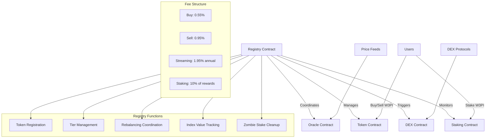

# W3PI - Web3 Polkadot Index

[](https://opensource.org/licenses/MIT)
[](https://use.ink/)
[](https://www.rust-lang.org/)
[](https://learn.onpop.io/)

A **tokenized index fund** for the Polkadot ecosystem featuring automated tier management, autonomous rebalancing, and professional-grade portfolio management. Built with ink! v5, showcasing advanced DeFi architecture with cross-contract integration and $100 base value tracking.

## 🌟 Features

- **📈 $100 Base Value Index**: Professional index tracking with clear performance metrics
- **🔄 Autonomous Rebalancing**: Monthly rebalancing with 4-week moving averages
- **🧹 Zombie Stake Cleanup**: Automatic reallocation of obsolete token stakes
- **🏆 Tier-Based Classification**: 4-tier system with 80% rule for automatic tier shifting
- **🔗 Cross-Contract Architecture**: Modular design with Registry, Oracle, DEX, Token, and Staking contracts
- **⚡ Real-time Price Feeds**: Live market data integration with price deviation protection
- **🛡️ Risk Management**: Emergency pause, liquidity buffers, and comprehensive monitoring

## 🏗️ Architecture



## 💰 Index Mechanics

### Base Value System

- **Starting Value**: $100 (fixed baseline for performance tracking)
- **Formula**: `Current Index Value = (Current Market Cap / Base Market Cap) × 100`
- **Example**: If total market cap grows 25%, index value becomes $125 (+25%)

### Tier Classification

| Tier   | Market Cap | 90-Day Volume |
| ------ | ---------- | ------------- |
| Tier 1 | $50M+      | $5M+          |
| Tier 2 | $250M+     | $25M+         |
| Tier 3 | $500M+     | $50M+         |
| Tier 4 | $2B+       | $200M+        |

**80% Rule**: Index automatically shifts to higher tiers when ≥80% of tokens qualify

### Fee Structure

| Operation       | Fee            | When Applied                      |
| --------------- | -------------- | --------------------------------- |
| Buy W3PI        | 0.55%          | Purchase transactions             |
| Sell W3PI       | 0.95%          | Sale transactions                 |
| Streaming Fee   | 1.95% annually | Portfolio management              |
| Staking Rewards | 10%            | Performance fee on staking yields |

## 🚀 Quick Start

### Prerequisites

```bash
# Install Rust and ink! toolchain
curl --proto '=https' --tlsv1.2 -sSf https://sh.rustup.rs | sh
rustup component add rust-src
rustup target add wasm32-unknown-unknown
cargo install --force --locked cargo-contract

# Install Pop CLI for Polkadot development
cargo install --git https://github.com/r0gue-io/pop-cli
```

### Build & Deploy

```bash
# Clone the repository
git clone https://github.com/yourusername/w3pi.git
cd w3pi

# Build all contracts
./scripts/build.sh

# Deploy to testnet (Paseo recommended)
./scripts/deploy.sh

# Initialize with base tokens
./scripts/setup-index.sh

# Run comprehensive tests
./scripts/test.sh
```

## 📋 Contract System

### 🎯 Registry Contract (Core Hub)

**Purpose**: Central coordinator managing the entire W3PI ecosystem

**Key Responsibilities**:

- Token registration and tier classification
- $100 base value tracking and index performance calculation
- Monthly rebalancing coordination using 4-week averages
- Autonomous zombie stake detection and reallocation
- Cross-contract operation orchestration
- Emergency pause and risk management

```rust
// Example: Get current index value
let index_value = registry.get_index_value()?;
// Returns: Current value relative to $100 base (e.g., $117.50 = +17.5%)
```

### 🔮 Oracle Contract

**Purpose**: Decentralized price feeds with TWAP and validation

**Features**:

- Multi-source price aggregation
- Time-weighted average price (TWAP) calculation
- Price deviation detection (max 5% threshold)
- Market cap and volume tracking
- Backup oracle fallback mechanisms

```rust
// Example: Get validated token price
let price = oracle.get_twap_price(token_address, time_window)?;
```

### 💱 DEX Contract

**Purpose**: Automated token swaps and liquidity management

**Features**:

- Multi-path swap optimization (direct, DOT-bridged, USDC-bridged)
- Slippage protection
- Liquidity buffer management (5% of portfolio)
- Emergency liquidity provision during mass redemptions

### 🪙 Token Contract (W3PI)

**Purpose**: W3PI token minting, burning, and transfer logic

**Features**:

- Dynamic supply based on market participation
- Order matching system (buyers vs sellers before mint/burn)
- Fee collection and distribution
- Performance tracking per holder

### 🥩 Staking Contract

**Purpose**: Automated staking of underlying assets with yield optimization

**Features**:

- Proportional staking based on portfolio weights
- Automatic reward claiming and reinvestment
- Variable unstaking periods per token
- 10% performance fee on all staking rewards

## 🧹 Autonomous Zombie Stake Management

### The Problem

When tokens get removed from the index, their staked portions remain locked, creating "zombie stakes" that don't contribute to index performance.

### Autonomous Solution

During monthly rebalancing, the system automatically:

1. **Detects** obsolete tokens (Tier::None + expired 90-day grace period)
2. **Unstakes** any remaining staked balances
3. **Liquidates** to USDC via optimal swap paths
4. **Redistributes** proceeds proportionally to current active tokens
5. **Emits** `ObsoleteStakeReallocated` events for transparency

**Result**: Users stay fully exposed to current index composition without manual intervention.

## 💡 Example Workflows

### Basic User Journey

```bash
# 1. User buys W3PI with USDC
pop call --message buy_w3pi --args 1000_000000  # $1,000 USDC
# → Receives W3PI tokens, system buys underlying assets

# 2. User stakes W3PI for yield
pop call --message stake_w3pi --args 500_000000  # Stake 500 W3PI
# → Underlying tokens automatically staked, user earns rewards

# 3. Monthly rebalancing occurs automatically
# → System unstakes obsolete tokens, rebalances portfolio

# 4. User sells W3PI
pop call --message sell_w3pi --args 200_000000  # Sell 200 W3PI
# → System liquidates proportional underlying assets, user receives USDC
```

### Index Performance Tracking

```bash
# Get current index performance
pop call --message get_index_value
# Returns: { "base_value": 100, "current_value": 125.50, "performance": "+25.5%" }

# Get detailed portfolio composition
pop call --message get_portfolio_composition
# Returns: Detailed breakdown of current tokens, weights, and values
```

## 🧪 Testing

### Comprehensive Test Suite

```bash
# Unit tests for all contracts
cargo test --workspace

# Integration tests
./scripts/integration-test.sh

# Rebalancing simulation
./scripts/test-rebalancing.sh

# Zombie stake cleanup test
./scripts/test-zombie-cleanup.sh

# Performance stress tests
./scripts/stress-test.sh
```

### Test Scenarios

- ✅ Index value calculation and base value tracking
- ✅ Tier shifting with 80% rule
- ✅ Monthly rebalancing with 4-week averages
- ✅ Zombie stake detection and cleanup
- ✅ Emergency pause triggers
- ✅ Cross-contract error handling
- ✅ Fee calculation and distribution
- ✅ Price deviation protection

## 📊 Performance Metrics

| Operation         | Gas Usage | Description                                |
| ----------------- | --------- | ------------------------------------------ |
| Buy W3PI          | ~3.5M gas | Purchase with underlying asset acquisition |
| Sell W3PI         | ~4.0M gas | Sale with proportional liquidation         |
| Monthly Rebalance | ~15M gas  | Full portfolio rebalancing                 |
| Zombie Cleanup    | ~8M gas   | Automatic obsolete stake reallocation      |
| Index Value Query | ~0.2M gas | Real-time performance calculation          |
| Stake W3PI        | ~5M gas   | Multi-token staking coordination           |

## 🔧 Advanced Features

### Monthly Rebalancing Algorithm

```rust
// Hybrid approach combining market cap weights with deviation limits
let four_week_average = calculate_market_cap_average(28_days);
let target_weights = normalize_weights(four_week_average);
let current_weights = get_current_portfolio_weights();

// Limit maximum shift to 20% of portfolio per month
let adjustments = calculate_bounded_adjustments(
    current_weights,
    target_weights,
    max_shift_pct: 20.0
);

execute_rebalancing(adjustments);
```

### Emergency Risk Management

```rust
// Automatic pause triggers
if mass_unstaking_detected(threshold: 25%) {
    trigger_emergency_pause("Mass unstaking detected");
}

if price_deviation_exceeded(threshold: 5%) {
    pause_trading_operations();
    emit_price_deviation_alert();
}
```

## 🌍 Real-World Applications

### Investment Use Cases

- **Passive Polkadot Exposure**: Diversified ecosystem investment without token picking
- **Institutional Portfolios**: Professional-grade index fund for institutional investors
- **Yield Enhancement**: Automated staking across multiple protocols for maximum returns
- **Risk Management**: Built-in protections against oracle manipulation and market volatility

### Integration Possibilities

- **Wallet Integration**: Native support in SubWallet, Talisman, etc.
- **DeFi Protocols**: Collateral for lending, liquidity provision
- **Portfolio Trackers**: Real-time performance monitoring and analytics
- **Robo-Advisors**: Automated investment allocation strategies

## 🔒 Security & Governance

### Multi-layered Security

- **3-of-5 Multisig**: Critical operations require multiple signatures
- **Timelock Mechanisms**: 24-hour delays for sensitive changes
- **Emergency Pause**: Automatic and manual pause capabilities
- **Shamir's Secret Sharing**: Backup recovery mechanisms
- **Price Validation**: Multiple oracle sources with deviation checks

### Risk Controls

- **Liquidity Buffers**: 5% USDC buffer for large redemptions
- **Position Limits**: Maximum concentration per token
- **Grace Periods**: 90-day waiting periods for token changes
- **Circuit Breakers**: Automatic halts during extreme conditions

## 📈 Roadmap

### Phase 1 - Core Infrastructure ✅

- [x] Multi-contract architecture
- [x] Base value tracking system
- [x] Autonomous rebalancing
- [x] Zombie stake management
- [x] Comprehensive testing

### Phase 2 - Enhanced Features 🚧

- [ ] Advanced analytics dashboard
- [ ] Multi-oracle price aggregation
- [ ] Governance token integration
- [ ] Cross-chain asset support
- [ ] Mobile wallet integration

### Phase 3 - Production Launch 📋

- [ ] Security audit completion
- [ ] Mainnet deployment
- [ ] Institutional partnerships
- [ ] Regulatory compliance
- [ ] Community governance transition

### Phase 4 - Ecosystem Expansion 🌟

- [ ] Additional index products (DeFi, Gaming, etc.)
- [ ] Automated portfolio construction
- [ ] AI-powered rebalancing
- [ ] Cross-ecosystem bridges

## 🌐 Network Support

### Current Testnets

- **Paseo** (Primary) - Polkadot testnet
- **Pop Network** - Specialized smart contract chain
- **Rococo** - Additional testing environment

### Planned Mainnets

- **Astar Network** - Primary deployment target
- **Moonbeam** - EVM compatibility layer
- **Acala** - DeFi-focused parachain
- **Asset Hub** - Native Polkadot asset management

## 📖 Documentation

| Document                                               | Description                            |
| ------------------------------------------------------ | -------------------------------------- |
| [Registry Contract](docs/registry-contract.md)         | Core coordinator implementation        |
| [Oracle Integration](docs/oracle-integration.md)       | Price feed architecture                |
| [Rebalancing Algorithm](docs/rebalancing-algorithm.md) | Mathematical models and implementation |
| [Fee Structure](docs/fee-structure.md)                 | Detailed fee calculations              |
| [Security Model](docs/security-model.md)               | Risk management and controls           |
| [API Reference](docs/api-reference.md)                 | Complete contract interfaces           |

## 🤝 Contributing

We welcome contributions from the Polkadot community!

### Development Setup

1. Fork the repository
2. Set up development environment with Pop CLI
3. Run the test suite to ensure everything works
4. Make your changes with appropriate tests
5. Submit a pull request with detailed description

### Areas for Contribution

- Algorithm optimization
- Additional oracle integrations
- Frontend development
- Documentation improvements
- Security enhancements

## 📄 License

This project is licensed under the MIT License - see the [LICENSE](LICENSE) file for details.

## 🙏 Acknowledgments

- **Parity Technologies** - ink! framework and Substrate ecosystem
- **Pop Network** - Development tools and infrastructure
- **Polkadot Community** - Feedback, testing, and support
- **Traditional Finance** - Index fund methodologies and best practices

---

**🚀 Building the future of decentralized index investing on Polkadot**

Ready to create professional-grade DeFi products? [Get started now!](#-quick-start)
