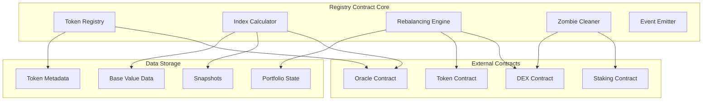

# Registry Contract Documentation

## Overview

The **Registry Contract** serves as the central hub and orchestrator of the entire W3PI ecosystem. It acts as the "brain" that coordinates all operations across the Oracle, DEX, Token, and Staking contracts while maintaining the $100 base value index system and autonomous portfolio management.

## Table of Contents

- [Core Responsibilities](#core-responsibilities)
- [Architecture](#architecture)
- [Data Structures](#data-structures)
- [Public Functions](#public-functions)
- [Internal Logic](#internal-logic)
- [Events](#events)
- [Error Handling](#error-handling)
- [Security Features](#security-features)
- [Integration Patterns](#integration-patterns)

## Core Responsibilities

### 1. Index Value Management
- **Base Value Tracking**: Immutable $100 baseline established at deployment
- **Real-time Calculation**: `Current Index Value = (Current Market Cap / Base Market Cap) × 100`
- **Performance Analytics**: Track percentage changes from baseline
- **Historical Data**: Maintain index value history for charts and analysis

### 2. Token Lifecycle Management
- **Registration**: Add new tokens with comprehensive metadata validation
- **Classification**: Automatic tier assignment based on market cap and volume
- **Grace Periods**: 90-day waiting periods for inclusion/exclusion decisions
- **Removal**: Automated removal of underperforming tokens after grace expiration

### 3. Portfolio Orchestration
- **Weight Calculation**: Market cap-based proportional weighting
- **Rebalancing Coordination**: Monthly rebalancing using 4-week moving averages
- **Cross-Contract Calls**: Coordinate buy/sell operations across DEX and Token contracts
- **Liquidity Management**: Maintain 5% USDC buffer for redemptions

### 4. Autonomous Zombie Stake Management
- **Detection**: Identify obsolete staked positions in removed tokens
- **Cleanup**: Automatic unstaking and liquidation during monthly rebalancing
- **Reallocation**: Proportional redistribution to current active tokens
- **Transparency**: Complete audit trail of cleanup operations

## Architecture



## Data Structures

### TokenData
```rust
pub struct TokenData {
    pub token_contract: AccountId,      // Token contract address
    pub symbol: String,                 // Token symbol (e.g., "DOT")
    pub tier: Tier,                     // Current tier classification
    pub market_cap: u128,               // Market cap in plancks
    pub volume_90d: u128,               // 90-day trading volume
    pub balance: u128,                  // Tokens held by registry
    pub weight_target: u128,            // Target weight (basis points)
    pub weight_current: u128,           // Current weight (basis points)
    pub staked_amount: u128,            // Amount currently staked
    pub grace_start: u64,               // Grace period start timestamp
    pub last_updated: u64,              // Last metadata update
    pub oracle_address: AccountId,      // Linked oracle contract
    pub is_active: bool,                // Active in current portfolio
}
```

### Tier Classification
```rust
pub enum Tier {
    None,    // Below thresholds or pending removal
    Tier1,   // $50M+ market cap, $5M+ volume
    Tier2,   // $250M+ market cap, $25M+ volume  
    Tier3,   // $500M+ market cap, $50M+ volume
    Tier4,   // $2B+ market cap, $200M+ volume
}
```

### IndexState
```rust
pub struct IndexState {
    pub base_value: u128,               // Fixed $100 in plancks
    pub base_market_cap: u128,          // Market cap at launch
    pub current_market_cap: u128,       // Current total market cap
    pub current_value: u128,            // Current index value
    pub performance_pct: i128,          // Performance vs base (basis points)
    pub last_updated: u64,              // Last calculation timestamp
    pub total_tokens: u32,              // Number of registered tokens
    pub active_tokens: u32,             // Tokens in current portfolio
}
```

### Snapshot
```rust
pub struct Snapshot {
    pub timestamp: u64,                                    // Snapshot timestamp
    pub token_prices: Mapping<AccountId, u128>,           // Token prices
    pub token_market_caps: Mapping<AccountId, u128>,      // Market capitalizations
    pub total_market_cap: u128,                           // Sum of all market caps
    pub index_value: u128,                                // Index value at snapshot
}
```

### RebalanceData
```rust
pub struct RebalanceData {
    pub four_week_averages: Mapping<AccountId, u128>,     // 4-week avg market caps
    pub target_weights: Mapping<AccountId, u128>,         // Target weights (basis points)
    pub current_weights: Mapping<AccountId, u128>,        // Current weights (basis points)
    pub adjustments: Vec<(AccountId, i128)>,              // Required adjustments
    pub max_shift_allowed: u128,                          // Max portfolio shift (20%)
    pub total_adjustment: u128,                           // Total adjustment size
}
```

## Public Functions

### Core Management Functions

#### `new() -> Self`
**Purpose**: Initialize the registry contract with base configuration
```rust
#[ink(constructor)]
pub fn new(
    oracle_default: AccountId,      // Default oracle contract
    dex_contract: AccountId,        // DEX contract for swaps
    token_contract: AccountId,      // W3PI token contract
    staking_contract: AccountId,    // Staking contract
    usdc_token: AccountId,         // USDC token address
    owners: Vec<AccountId>,        // Multisig owners (3-of-5)
) -> Self
```

#### `register_token() -> Result<(), Error>`
**Purpose**: Register a new token in the index
```rust
#[ink(message)]
pub fn register_token(
    &mut self,
    token_contract: AccountId,      // Token contract address
    symbol: String,                 // Token symbol
    oracle_address: AccountId,      // Oracle for this token
    initial_market_cap: u128,       // Current market cap
    initial_volume: u128,           // 90-day volume
) -> Result<(), Error>
```

**Process**:
1. Validate token contract exists and is callable
2. Determine initial tier based on market cap and volume
3. Set grace period start time if tier is None
4. Store token metadata with linked oracle
5. Emit `TokenRegistered` event

#### `remove_token() -> Result<(), Error>`
**Purpose**: Remove underperforming or obsolete tokens
```rust
#[ink(message)]
pub fn remove_token(
    &mut self,
    token_contract: AccountId,      // Token to remove
    force: bool,                    // Bypass grace period (owner only)
) -> Result<(), Error>
```

**Validation**:
- Grace period expired (90+ days) OR force=true by owner
- Token tier is `None` 
- No active staked positions (or auto-cleanup completed)

### Index Value Functions

#### `get_index_value() -> Result<IndexValue, Error>`
**Purpose**: Calculate current index value relative to $100 base
```rust
#[ink(message)]
pub fn get_index_value(&self) -> Result<IndexValue, Error>

pub struct IndexValue {
    pub base_value: u128,           // Always $100
    pub current_value: u128,        // Current calculated value
    pub performance_pct: i128,      // Performance in basis points
    pub market_cap_total: u128,     // Current total market cap
    pub last_updated: u64,          // Calculation timestamp
}
```

**Calculation**:
```rust
let current_market_cap = self.calculate_total_market_cap()?;
let current_value = (current_market_cap * BASE_VALUE) / self.base_market_cap;
let performance = ((current_value - BASE_VALUE) * 10000) / BASE_VALUE;
```

#### `update_index_value() -> Result<(), Error>`
**Purpose**: Refresh index value with latest market data
```rust
#[ink(message)]
pub fn update_index_value(&mut self) -> Result<(), Error>
```

**Process**:
1. Query oracle contracts for latest prices
2. Calculate market caps for all active tokens
3. Sum total market cap
4. Apply index formula
5. Update storage and emit `IndexValueUpdated` event

### Portfolio Management Functions

#### `get_portfolio_composition() -> Result<PortfolioComposition, Error>`
**Purpose**: Get detailed breakdown of current portfolio
```rust
#[ink(message)]
pub fn get_portfolio_composition(&self) -> Result<PortfolioComposition, Error>

pub struct PortfolioComposition {
    pub total_value: u128,                              // Total portfolio value
    pub tokens: Vec<TokenPosition>,                     // Individual positions
    pub tier_distribution: Mapping<Tier, u32>,         // Tokens per tier
    pub liquidity_buffer: u128,                        // USDC buffer amount
    pub last_rebalance: u64,                           // Last rebalance timestamp
}

pub struct TokenPosition {
    pub token_contract: AccountId,
    pub symbol: String,
    pub balance: u128,              // Tokens held
    pub value_usd: u128,           // USD value
    pub weight_current: u128,      // Current weight (basis points)
    pub weight_target: u128,       // Target weight (basis points)
    pub staked_amount: u128,       // Amount staked
    pub tier: Tier,               // Current tier
}
```

#### `rebalance_monthly() -> Result<(), Error>`
**Purpose**: Execute monthly portfolio rebalancing
```rust
#[ink(message)]
pub fn rebalance_monthly(&mut self) -> Result<(), Error>
```

**Algorithm**:
1. **Snapshot Validation**: Ensure 4 weekly snapshots available
2. **Average Calculation**: Compute 4-week moving averages
3. **Weight Determination**: Calculate target weights from averages
4. **Deviation Analysis**: Identify tokens requiring adjustment
5. **Bounded Adjustments**: Limit total portfolio shift to 20%
6. **Execution**: Coordinate swaps via DEX contract
7. **Zombie Cleanup**: Handle obsolete staked positions
8. **Verification**: Validate final portfolio state

### Tier Management Functions

#### `update_tiers() -> Result<(), Error>`
**Purpose**: Recalculate tiers and apply 80% rule
```rust
#[ink(message)]
pub fn update_tiers(&mut self) -> Result<(), Error>
```

**80% Rule Logic**:
```rust
let total_tokens = self.tokens.len();
for tier in [Tier4, Tier3, Tier2, Tier1] {
    let tier_count = count_tokens_in_tier(tier);
    let percentage = (tier_count * 100) / total_tokens;
    
    if percentage >= 80 {
        if tier != self.current_tier {
            self.shift_to_tier(tier)?;
            break;
        }
    }
}
```

#### `force_tier_shift() -> Result<(), Error>`
**Purpose**: Manually override tier (emergency function)
```rust
#[ink(message)]
pub fn force_tier_shift(
    &mut self,
    new_tier: Tier,                 // Target tier
    reason: String,                 // Justification
) -> Result<(), Error>
```

**Access Control**: Owner-only with multisig approval

### Snapshot Functions

#### `take_snapshot() -> Result<(), Error>`
**Purpose**: Create weekly price and market cap snapshot
```rust
#[ink(message)]
pub fn take_snapshot(&mut self) -> Result<(), Error>
```

**Process**:
1. Query all oracle contracts for current prices
2. Calculate market caps for each token
3. Store snapshot with timestamp
4. Maintain rolling window of 4 snapshots
5. Emit `SnapshotTaken` event

#### `get_snapshots() -> Vec<Snapshot>`
**Purpose**: Retrieve snapshot history for analysis
```rust
#[ink(message)]
pub fn get_snapshots(&self) -> Vec<Snapshot>
```

### Zombie Stake Management

#### `cleanup_zombie_stakes() -> Result<CleanupResult, Error>`
**Purpose**: Automatically handle obsolete staked positions
```rust
#[ink(message)]
pub fn cleanup_zombie_stakes(&mut self) -> Result<CleanupResult, Error>

pub struct CleanupResult {
    pub tokens_processed: u32,          // Number of obsolete tokens found
    pub total_unstaked: u128,           // Total amount unstaked
    pub usdc_recovered: u128,           // USDC from liquidation
    pub redistribution_complete: bool,  // Whether redistribution succeeded
    pub events_emitted: u32,           // Number of events emitted
}
```

**Algorithm**:
1. **Detection**: Find tokens with `Tier::None` and expired grace periods
2. **Unstaking**: Call staking contract to unstake positions
3. **Liquidation**: Convert to USDC via DEX contract
4. **Reallocation**: Distribute USDC proportionally to active tokens
5. **Purchase**: Buy active tokens with redistributed USDC
6. **Events**: Emit detailed transparency events

## Internal Logic

### Market Cap Calculation
```rust
fn calculate_total_market_cap(&self) -> Result<u128, Error> {
    let mut total = 0u128;
    
    for (token_contract, token_data) in self.tokens.iter() {
        // Get current price from oracle
        let price = self.query_oracle_price(token_contract, &token_data.oracle_address)?;
        
        // Calculate market cap (simplified: price * balance held)
        let market_cap = price.saturating_mul(token_data.balance);
        total = total.saturating_add(market_cap);
    }
    
    Ok(total)
}
```

### Weight Calculation
```rust
fn calculate_target_weights(&self, market_caps: &Mapping<AccountId, u128>) -> Mapping<AccountId, u128> {
    let total_market_cap: u128 = market_caps.values().sum();
    let mut weights = Mapping::default();
    
    for (token, market_cap) in market_caps.iter() {
        // Weight in basis points (10000 = 100%)
        let weight = (market_cap * 10000) / total_market_cap;
        weights.insert(*token, &weight);
    }
    
    weights
}
```

### Rebalancing Logic
```rust
fn execute_rebalancing(&mut self, adjustments: &[(AccountId, i128)]) -> Result<(), Error> {
    for (token_contract, adjustment) in adjustments {
        if *adjustment > 0 {
            // Need to buy more of this token
            let buy_amount = *adjustment as u128;
            self.coordinate_token_purchase(*token_contract, buy_amount)?;
        } else if *adjustment < 0 {
            // Need to sell some of this token
            let sell_amount = adjustment.abs() as u128;
            self.coordinate_token_sale(*token_contract, sell_amount)?;
        }
    }
    
    Ok(())
}
```

## Events

### Core Events
```rust
#[ink(event)]
pub struct TokenRegistered {
    #[ink(topic)]
    pub token_contract: AccountId,
    pub symbol: String,
    pub tier: Tier,
    pub market_cap: u128,
    pub oracle_address: AccountId,
}

#[ink(event)]
pub struct TokenRemoved {
    #[ink(topic)]
    pub token_contract: AccountId,
    pub reason: String,
    pub final_balance: u128,
    pub usdc_recovered: u128,
}

#[ink(event)]
pub struct IndexValueUpdated {
    pub previous_value: u128,
    pub current_value: u128,
    pub performance_change: i128,
    pub market_cap_total: u128,
    pub timestamp: u64,
}

#[ink(event)]
pub struct TierShifted {
    pub previous_tier: Tier,
    pub new_tier: Tier,
    pub trigger_reason: String,
    pub tokens_affected: u32,
}

#[ink(event)]
pub struct RebalanceExecuted {
    pub total_adjustments: u32,
    pub portfolio_shift_pct: u128,
    pub gas_used: u128,
    pub timestamp: u64,
}

#[ink(event)]
pub struct SnapshotTaken {
    pub snapshot_id: u32,
    pub tokens_captured: u32,
    pub total_market_cap: u128,
    pub index_value: u128,
    pub timestamp: u64,
}

#[ink(event)]
pub struct ObsoleteStakeReallocated {
    #[ink(topic)]
    pub obsolete_token: AccountId,
    pub amount_unstaked: u128,
    pub usdc_recovered: u128,
    pub redistribution_targets: Vec<AccountId>,
    pub timestamp: u64,
}
```

### Emergency Events
```rust
#[ink(event)]
pub struct EmergencyPause {
    pub trigger_reason: String,
    pub paused_operations: Vec<String>,
    pub timestamp: u64,
}

#[ink(event)]
pub struct PriceDeviationAlert {
    #[ink(topic)]
    pub token_contract: AccountId,
    pub expected_price: u128,
    pub actual_price: u128,
    pub deviation_pct: u128,
}
```

## Error Handling

### Error Types
```rust
#[derive(Debug, PartialEq, Eq, scale::Encode, scale::Decode)]
#[cfg_attr(feature = "std", derive(scale_info::TypeInfo))]
pub enum Error {
    // Authorization
    Unauthorized,
    MultisigRequired,
    
    // Data Validation
    InvalidTokenContract,
    InvalidMarketCap,
    InvalidVolume,
    InsufficientSnapshots,
    
    // State Management
    TokenAlreadyRegistered,
    TokenNotFound,
    GracePeriodActive,
    TierShiftInProgress,
    
    // Cross-Contract Calls
    OracleCallFailed,
    DexCallFailed,
    StakingCallFailed,
    TokenCallFailed,
    
    // Calculations
    MathOverflow,
    DivisionByZero,
    InvalidWeight,
    
    // Emergency
    ContractPaused,
    EmergencyState,
    RebalanceBlocked,
}
```

### Error Recovery
```rust
fn handle_oracle_failure(&self, token_contract: &AccountId) -> Result<u128, Error> {
    // Try backup oracle
    if let Some(backup_oracle) = self.backup_oracles.get(token_contract) {
        return self.query_oracle_price(token_contract, backup_oracle);
    }
    
    // Use last known price with age validation
    if let Some(last_price) = self.last_known_prices.get(token_contract) {
        let age = self.env().block_timestamp() - last_price.timestamp;
        if age < MAX_PRICE_AGE {
            return Ok(last_price.value);
        }
    }
    
    Err(Error::OracleCallFailed)
}
```

## Security Features

### Access Control
```rust
// Multisig requirement for critical operations
fn ensure_multisig_approval(&self, operation: &str) -> Result<(), Error> {
    let required_sigs = 3; // 3-of-5 multisig
    let approvals = self.pending_approvals.get(operation).unwrap_or(0);
    
    if approvals < required_sigs {
        return Err(Error::MultisigRequired);
    }
    
    Ok(())
}

// Owner-only functions
fn ensure_owner(&self) -> Result<(), Error> {
    let caller = self.env().caller();
    if !self.owners.contains(&caller) {
        return Err(Error::Unauthorized);
    }
    Ok(())
}
```

### Circuit Breakers
```rust
fn check_emergency_conditions(&mut self) -> Result<(), Error> {
    // Check for mass unstaking
    let unstake_ratio = self.pending_unstakes / self.total_staked;
    if unstake_ratio > EMERGENCY_UNSTAKE_THRESHOLD {
        self.trigger_emergency_pause("Mass unstaking detected")?;
        return Err(Error::EmergencyState);
    }
    
    // Check for extreme price deviations
    for (token, data) in self.tokens.iter() {
        let current_price = self.query_oracle_price(token, &data.oracle_address)?;
        let deviation = calculate_deviation(current_price, data.last_known_price);
        
        if deviation > MAX_PRICE_DEVIATION {
            self.trigger_emergency_pause("Price manipulation detected")?;
            return Err(Error::EmergencyState);
        }
    }
    
    Ok(())
}
```

## Integration Patterns

### Cross-Contract Communication
```rust
// Oracle price query with fallback
fn query_oracle_price(&self, token: &AccountId, oracle: &AccountId) -> Result<u128, Error> {
    let result = build_call::<OracleRef>()
        .callee(*oracle)
        .gas_limit(2_000_000)
        .exec_input(
            ExecutionInput::new(Selector::new(ink::selector_bytes!("get_price")))
                .push_arg(token)
        )
        .returns::<Option<u128>>()
        .try_invoke();
        
    match result {
        Ok(Ok(Some(price))) => Ok(price),
        Ok(Ok(None)) => self.handle_oracle_failure(token),
        Ok(Err(_)) => self.handle_oracle_failure(token),
        Err(_) => Err(Error::OracleCallFailed),
    }
}

// DEX swap coordination
fn coordinate_token_purchase(&mut self, token: AccountId, amount: u128) -> Result<(), Error> {
    build_call::<DexRef>()
        .callee(self.dex_contract)
        .gas_limit(5_000_000)
        .exec_input(
            ExecutionInput::new(Selector::new(ink::selector_bytes!("swap_exact_usdc_for_tokens")))
                .push_arg(&self.usdc_token)
                .push_arg(&token)
                .push_arg(amount)
                .push_arg(&self.calculate_min_output(amount)?)
        )
        .returns::<Result<u128, DexError>>()
        .invoke()
        .map_err(|_| Error::DexCallFailed)??;
        
    Ok(())
}
```

### State Synchronization
```rust
fn sync_portfolio_state(&mut self) -> Result<(), Error> {
    // Update token balances from token contract
    for (token_contract, token_data) in self.tokens.iter_mut() {
        let current_balance = self.query_token_balance(token_contract)?;
        token_data.balance = current_balance;
    }
    
    // Update staked amounts from staking contract
    let total_staked = self.query_total_staked()?;
    self.total_staked_amount = total_staked;
    
    // Recalculate weights
    self.recalculate_weights()?;
    
    Ok(())
}
```

## Performance Considerations

### Gas Optimization
- **Batch Operations**: Group multiple token operations to reduce gas costs
- **Lazy Loading**: Only load necessary data for each operation
- **Efficient Storage**: Use packed structs and optimized mappings
- **Circuit Breaking**: Fail fast on invalid conditions

### Scalability
- **Pagination**: Support paginated queries for large token lists
- **Incremental Updates**: Process rebalancing in chunks if needed
- **State Caching**: Cache frequently accessed calculations
- **Event Indexing**: Structure events for efficient frontend queries

This Registry Contract serves as the sophisticated orchestrator that makes W3PI a professional-grade index fund while maintaining the flexibility and transparency expected in DeFi applications.